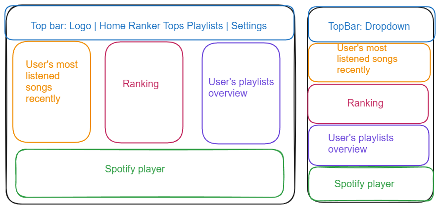
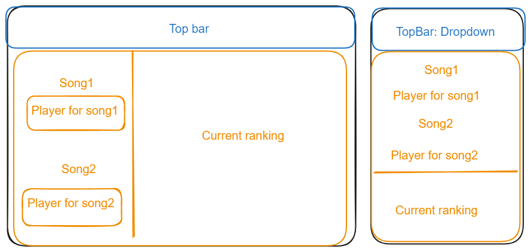
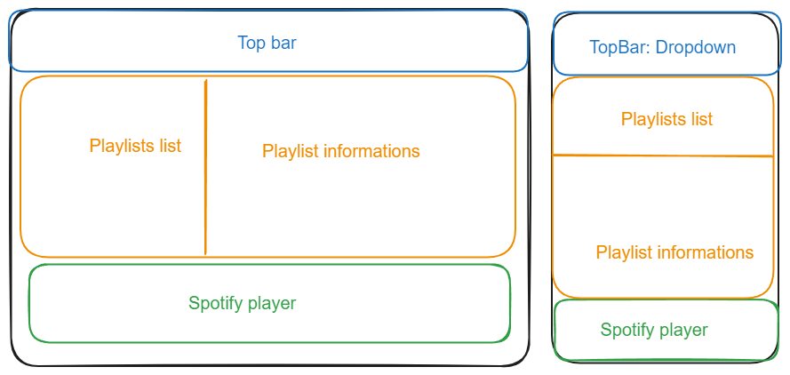
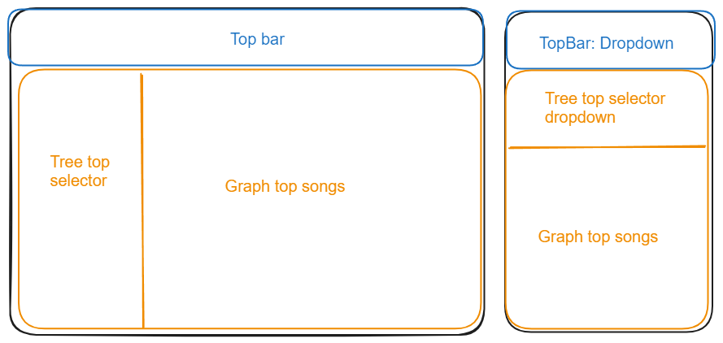

# Spotify Stats frontend <!-- omit from toc --> 

- [Spotify API call](#spotify-api-call)
- [Wireframes](#wireframes)
  - [Home page](#home-page)
  - [Ranker Page](#ranker-page)
  - [Playlists Page](#playlists-page)
  - [Tops Page](#tops-page)

## Spotify API call 
- Player
  - To add the possibility to listen to songs especially in ranking but also in topsongs.
  - Have a player in the app.
- Playlists
  - Add top playlists for periods if not already exist
  - Manage the top ranking playlist
- Tracks
  - Get user's saved tracks and check for doubles
- Users
  - Get user's id
  - Get user's top items

## Wireframes

### Home page

### Ranker Page

### Playlists Page

### Tops Page
